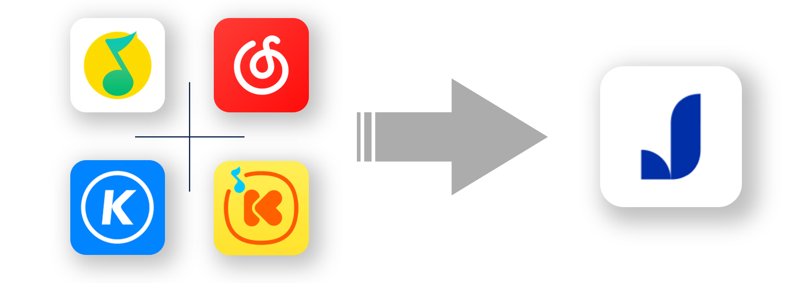

<h3 align="right">中文 / <a href="README_ENG.md">English</a></h3>
<p align="center">
    
</p>
    <h2 align="center">椒盐歌单助手</h2>
    <h2 align="center" style="padding-top: 0">前后端重构版——后端仓库</h2>

---

### 项目介绍

[原项目](https://github.com/Winnie0408/SaltPlayerConverter)前后端重构版的后端代码仓库。

项目功能的使用教程在[原项目](https://github.com/Winnie0408/SaltPlayerConverter)的README，本README只包含**如何自行运行本项目**。

重构版 前端仓库：[SaltPlayerConverterFrontEnd](https://github.com/Winnie0408/SaltPlayerConverterFrontEnd)

### 需要使用的硬件与软件

必须：

- 电脑或服务器

任选：

- Java IDE
- JDK (版本 >= 17)
- JRE (版本 >= 17)
- Maven

### 项目的使用与运行（三选一即可）

#### 1. 使用Java IDE（如IntelliJ IDEA、Eclipse等）从源码运行

1. 克隆或下载本项目的源码。

```bash
git clone git@github.com:Winnie0408/SaltPlayerConverterBackEnd.git
```

2. 使用Java IDE打开本并信任项目。
3. 打开项目根目录下的`pom.xml`文件，使用IDE自带的Maven工具下载项目所需的依赖。（推荐[配置Maven源为阿里云或其他国内镜像](README.md#配置maven镜像源)，以加快下载速度）。
4. （可选）在`src/main/resources/application.yml`文件的`port`节点，修改后端服务运行的端口（默认为8082）。
5. 运行项目中的`src/main/java/Main.java`文件。

#### 2. 使用Maven从源码编译、并运行JAR包

1. 克隆或下载本项目的源码。

```bash
git clone git@github.com:Winnie0408/SaltPlayerConverterBackEnd.git
```

2. （可选）在`src/main/resources/application.yml`文件的`port`节点，修改后端服务运行的端口（默认为8082）。
3. 进入项目目录，使用Maven编译项目。（推荐[配置Maven源为阿里云或其他国内镜像](README.md#配置maven镜像源)，以加快下载速度）。

```bash
mvn clean package
```

4. 等待编译完成，控制台输出`BUILD SUCCESS`，进入项目中的`target`目录，运行以`.jar`结尾的文件。

```bash
java -jar [FileName].jar
```

#### 3. 下载并运行JAR包（默认占用8082端口）

1. 在项目的[Release页面](https://github.com/Winnie0408/SaltPlayerConverterBackEnd/releases)，找到最新版本，下载以`.jar`结尾的文件。
2. 运行刚刚下载的JAR包。

```bash
java -jar [FileName].jar
```

### 配置Maven镜像源

#### Windows

- 使用自行安装的Maven
    1. 在Maven的安装目录中，找到并打开`conf/settings.xml`文件（没有的话就自行创建一个）。
    2. 在该文件的`<mirrors></mirrors>`节点中添加子节点。
- 使用IDE自带的Maven
    1. 进入`C:\Users\[Username]\.m2`目录，找到并打开`settings.xml`文件（没有的话就自行创建一个）。
    2. 在该文件的`<mirrors></mirrors>`节点中添加子节点。

#### Linux

1. 进入`/etc/maven/conf`目录，找到并打开`settings.xml`文件。
2. 在该文件的`<mirrors></mirrors>`节点中添加子节点。

#### 可用子节点（添加一个或多个皆可）

- 阿里云

```xml

<mirror>
    <id>aliyunmaven</id>
    <mirrorOf>*</mirrorOf>
    <name>阿里云公共仓库</name>
    <url>https://maven.aliyun.com/repository/public</url>
</mirror>
```

- 网易

```xml

<mirror>
    <id>netease</id>
    <url>http://maven.netease.com/repository/public/</url>
    <mirrorOf>central</mirrorOf>
</mirror>
  ```

- 中国科学技术大学USTC

```xml

<mirror>
    <id>ustc</id>
    <url>http://mirrors.ustc.edu.cn/maven/maven2/</url>
    <mirrorOf>central</mirrorOf>
</mirror>
 ```

- [其他镜像源](https://blog.csdn.net/qq_38217990/article/details/129257106)

#### 完整配置文件示例

```xml
<?xml version="1.0" encoding="UTF-8"?>
<settings xmlns="http://maven.apache.org/SETTINGS/1.0.0"
          xmlns:xsi="http://www.w3.org/2001/XMLSchema-instance"
          xsi:schemaLocation="http://maven.apache.org/SETTINGS/1.0.0 http://maven.apache.org/xsd/settings-1.0.0.xsd">
    <mirrors>
        <!-- 阿里云仓库 -->
        <mirror>
            <id>alimaven</id>
            <mirrorOf>central</mirrorOf>
            <name>aliyun maven</name>
            <url>http://maven.aliyun.com/nexus/content/repositories/central/</url>
        </mirror>


        <!-- 中央仓库1 -->
        <mirror>
            <id>repo1</id>
            <mirrorOf>central</mirrorOf>
            <name>Human Readable Name for this Mirror.</name>
            <url>https://repo1.maven.org/maven2/</url>
        </mirror>


        <!-- 中央仓库2 -->
        <mirror>
            <id>repo2</id>
            <mirrorOf>central</mirrorOf>
            <name>Human Readable Name for this Mirror.</name>
            <url>https://repo2.maven.org/maven2/</url>
        </mirror>

        <mirror>
            <id>repo2</id>
            <mirrorOf>central</mirrorOf>
            <name>Human Readable Name for this Mirror.</name>
            <url>https://search.maven.org/</url>
        </mirror>
    </mirrors>

</settings>
```

## 赞助与支持

🥰🥰🥰

如果这个项目对您有所帮助，您可以给我一颗免费的⭐，或者请我喝杯咖啡！<br>
非常感谢您的支持！ <br>
⬇️⬇️⬇️<br>
<a href="markdownResources/Alipay WeChatPay.jpg">

</a>

